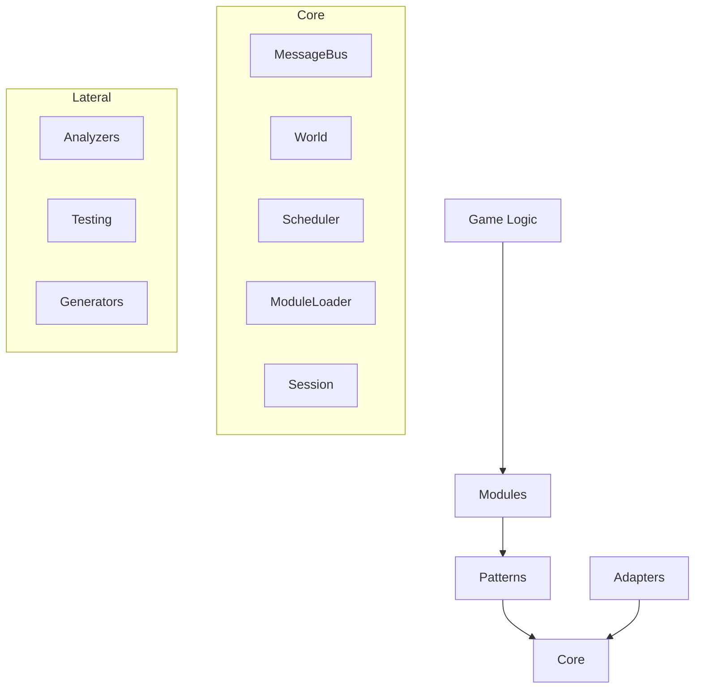
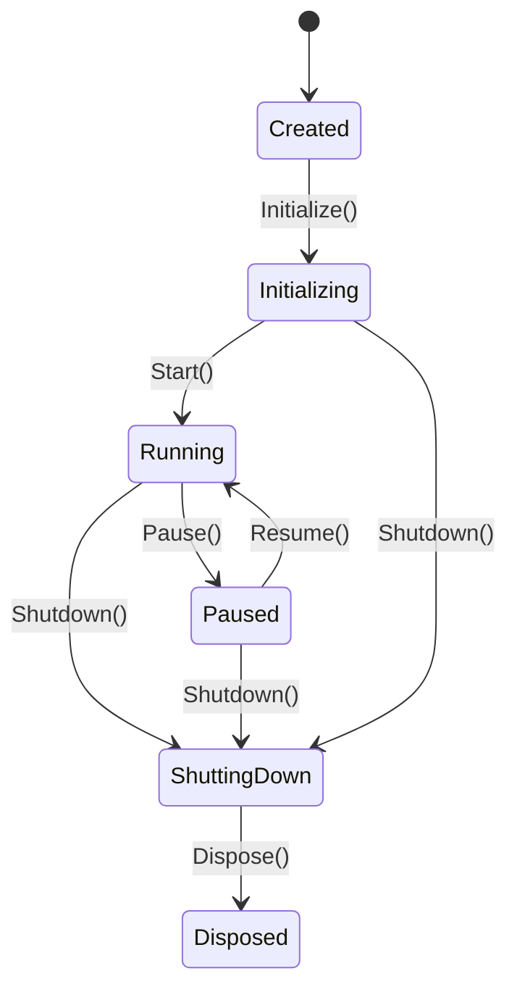
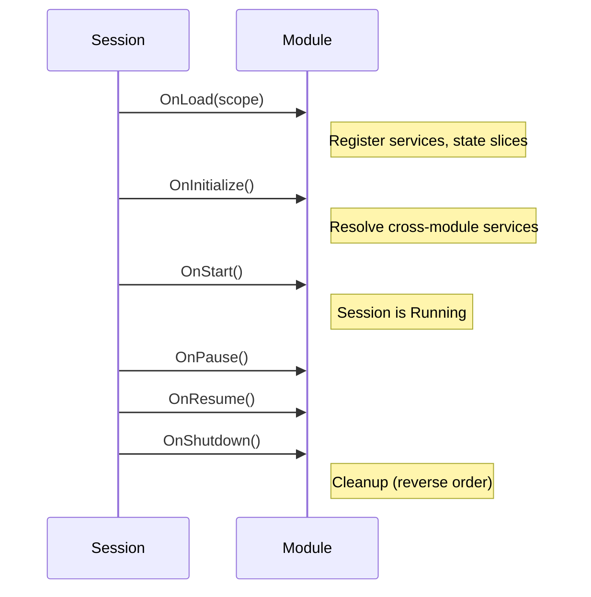

# Flos Architecture Guide

This guide covers the practical usage of the Flos framework. It assumes you are a C# developer targeting .NET 10+ who has never used Flos before.

## Table of Contents

- [Getting Started](#getting-started)
- [Core Concepts](#core-concepts)
- [Choosing a Pattern](#choosing-a-pattern)
- [Module Development Guide](#module-development-guide)
- [Custom Pattern Development](#custom-pattern-development)
- [Engine Integration Guide](#engine-integration-guide)
- [Error Handling Guide](#error-handling-guide)
- [Performance Guidelines](#performance-guidelines)
- [Common Mistakes](#common-mistakes)

---

## Getting Started

### Minimal Session (No Pattern)

The simplest Flos application creates a session with a random module and a custom game module:

```csharp
using Flos.Core.Module;
using Flos.Core.Sessions;
using Flos.Core.Scheduling;
using Flos.Core.State;
using Flos.Random;

// 1. Define your state
public class CounterState : IStateSlice
{
    public int Value { get; set; }
}

// 2. Define your module
public class CounterModule : ModuleBase
{
    public override string Id => "Counter";
    public override IReadOnlyList<string> Dependencies => ["Random"];

    public override void OnLoad(IServiceScope scope)
    {
        base.OnLoad(scope);
        var world = scope.Resolve<IWorld>();
        world.Register(new CounterState());
    }
}

// 3. Create and run a session
var session = new Session();
session.Initialize(new SessionConfig
{
    Modules = [new RandomModule(), new CounterModule()],
    TickMode = TickMode.StepBased,
    RandomSeed = 42
});
session.Start();

// 4. Access state and tick
var counter = session.World.Get<CounterState>();
counter.Value++;
session.Scheduler.Step();

// 5. Cleanup
session.Shutdown();
session.Dispose();
```

### With CQRS Pattern

For games that need auditable state transitions:

```csharp
using Flos.Pattern.CQRS;
using Flos.Snapshot;
using Flos.Identity;

var session = new Session();
session.Initialize(new SessionConfig
{
    Modules = [
        new RandomModule(),
        new IdentityModule(),
        new SnapshotModule(),
        new CQRSPatternModule(),
        new MyGameModule()
    ],
    TickMode = TickMode.StepBased,
    RandomSeed = 42
});
session.Start();

var pipeline = session.RootScope.Resolve<IPipeline>();
pipeline.Send(new MyCommand(CommandSource.System, null));
```

---

## Core Concepts

### Architecture Overview



**Dependency direction:** Games → Modules → Patterns → Core ← Adapters.

### Session

`ISession` is the top-level container that owns everything: the world, scheduler, message bus, service scope, and module lifecycle.



**Lifecycle messages** are published at each transition: `SessionInitializedMessage`, `SessionStartedMessage`, `SessionPausedMessage`, `SessionResumedMessage`, `SessionShutdownMessage`.

### World

`IWorld` is the single source of truth for all game state. It stores typed `IStateSlice` instances:

```csharp
// Register during OnLoad
world.Register(new InventoryState());

// Access anywhere
var inventory = world.Get<InventoryState>();
inventory.Gold += 100;
```

State slices are **mutable reference types** (classes). Each type can only be registered once. Core does not enforce how state is mutated — that's a Pattern-level concern.

### MessageBus

`IMessageBus` provides type-safe pub/sub with priority-ordered, synchronous dispatch:

```csharp
// Subscribe (lower priority = earlier execution)
// WARNING: This anti-pattern is for simplicity but not recommended, see Common Mistakes
var sub = bus.Subscribe<DamageMessage>(msg =>
{
    // handle damage
}, priority: 0);

// Publish
bus.Publish(new DamageMessage(target, amount));

// Unsubscribe
sub.Dispose();
```

**Key properties:**
- Zero-allocation dispatch in steady state
- Middleware pipeline for cross-cutting concerns (e.g., CQRS command routing)
- Re-entrant: publishing during a publish is safe
- Main-thread only — use `IDispatcher` for cross-thread access

### Scheduler

`IScheduler` controls simulation tick dispatch in two modes:

| Mode | Usage | DeltaTime |
|------|-------|-----------|
| `StepBased` | Turn-based games, deterministic replay | Always `0f` |
| `FixedTick` | Real-time simulations | `SessionConfig.FixedTimeStep` |

```csharp
// StepBased: one tick per call
scheduler.Step();

// FixedTick: accumulates time, fires fixed-step ticks
scheduler.Tick(deltaTime); // from engine's Update loop
```

Each tick: drain `IDispatcher` queue → publish `TickMessage` → subscribers execute.

### Modules

Modules are black boxes with a defined lifecycle:



**Loading sequence:**
1. Topological sort by `Dependencies`
2. `OnLoad` in dependency order (register services)
3. Pattern validation (`RequiredPatterns` vs loaded patterns)
4. Scope locked (no more registrations)
5. `OnInitialize` in dependency order (resolve services)

---

## Choosing a Pattern

| Criteria | Standalone | CQRS | ECS | Multi-Pattern |
|----------|-----------|------|-----|---------------|
| **State changes** | Direct mutation | Via commands/events | Direct system writes | Mixed |
| **Frequency** | Low | Low–Medium | High (thousands/frame) | Varies |
| **Auditability** | None | Full event journal | None built-in | Per-pattern |
| **Replay** | Manual | Automatic | Manual | Partial |
| **Best for** | Prototypes, simple games | Card/board/strategy | Bullet-hell, RTS, physics | Complex games |

### Standalone (No Pattern)

Mutate state slices directly. No pipeline overhead. No audit trail.

```csharp
public class MyModule : ModuleBase
{
    public override string Id => "My";

    public override void OnInitialize()
    {
        var bus = Scope.Resolve<IMessageBus>();
        bus.Subscribe<TickMessage>(OnTick);
    }

    private void OnTick(TickMessage tick)
    {
        var state = Scope.Resolve<IWorld>().Get<MyState>();
        state.Counter++;
    }
}
```

### CQRS

Commands are validated against read-only state. Events mutate state atomically. Full audit trail via event journal.

**Use when:** You need replay, undo, networking, or auditable state transitions.

### ECS

Delegate to an external ECS framework (Arch, DefaultEcs, Flecs.NET) via `IECSAdapter`. Flos provides lifecycle integration and identity bridging.

**Use when:** You have thousands of entities per frame and need cache-friendly iteration.

### Multi-Pattern

Multiple patterns can coexist. Each subscribes to `TickMessage` with its own priority. Cross-pattern communication uses MessageBus.

```csharp
// Both patterns active:
Modules = [
    new CQRSPatternModule(),  // handles discrete game logic
    new ECSPatternModule(adapter),  // handles physics/particles
    // game modules...
]
```

---

## Module Development Guide

### Basic Module

```csharp
public class HealthModule : ModuleBase
{
    public override string Id => "Health";
    public override IReadOnlyList<string> Dependencies => ["Identity"];

    private IMessageBus _bus = null!;

    public override void OnLoad(IServiceScope scope)
    {
        base.OnLoad(scope);
        var world = scope.Resolve<IWorld>();
        world.Register(new HealthState());
    }

    public override void OnInitialize()
    {
        // Resolve and cache services here (scope is locked)
        _bus = Scope.Resolve<IMessageBus>();
        _bus.Subscribe<TickMessage>(OnTick);
    }

    private void OnTick(TickMessage tick)
    {
        // Per-tick logic using cached references
    }
}
```

### Module Lifecycle Rules

- **OnLoad:** Register services, state slices, subscriptions. The scope is still open.
- **OnInitialize:** Scope is locked. Resolve cross-module services and cache references.
- **OnStart/OnPause/OnResume/OnShutdown:** React to session state changes.
- **Shutdown order:** Reverse dependency order. Exceptions are caught and logged.

### Contract Packages

For cross-module communication, create a separate Contract package containing only:
- Message types (`IMessage` implementations)
- `IStateSlice` definitions
- Read-only service interfaces
- `ErrorCode` constants

Other modules depend on Contract packages, never on implementation packages. The FLOS017 analyzer enforces this.

### Optional Dependencies

For soft dependencies (not in `Dependencies`), check availability in `OnInitialize`:

```csharp
public override void OnInitialize()
{
    if (Scope.IsRegistered<IProfiler>())
    {
        _profiler = Scope.Resolve<IProfiler>();
    }
    else
    {
        _profiler = new NoOpProfiler();
    }
}
```

---

## Custom Pattern Development

Create a custom pattern in six steps:

```csharp
// 1. Define a PatternId
public static class MyPattern
{
    public static readonly PatternId Id = new("MyPattern");
}

// 2. Create the pattern module (depends only on Core)
public class MyPatternModule : ModuleBase
{
    public override string Id => "MyPattern";

    public override void OnLoad(IServiceScope scope)
    {
        base.OnLoad(scope);

        // 3. Register the pattern
        var registry = scope.Resolve<IPatternRegistry>();
        registry.Register(MyPattern.Id);

        // 4. Register pattern services
        scope.RegisterInstance<IMyPatternService>(new MyPatternService());

        // 5. Install middleware (optional)
        var bus = scope.Resolve<IMessageBus>();
        bus.Use(new MyPatternMiddleware());
    }

    public override void OnInitialize()
    {
        // 6. Subscribe to TickMessage
        var bus = Scope.Resolve<IMessageBus>();
        bus.Subscribe<TickMessage>(OnTick, priority: 50);
    }

    private void OnTick(TickMessage tick) { /* drive pattern logic */ }
}
```

Patterns are structurally equal — no pattern has Core-level privilege. Multiple patterns coexist via `TickMessage` subscription priority.

---

## Engine Integration Guide

### Console Adapter

For headless servers, CLI testing, and prototypes:

```csharp
var session = new Session();
session.Initialize(new SessionConfig
{
    Modules = [new ConsoleAdapterModule(), new RandomModule(), /* ... */],
    TickMode = TickMode.StepBased,
    RandomSeed = 42
});
session.Start();

while (running)
{
    session.Scheduler.Step();
}

session.Shutdown();
session.Dispose();
```

### Unity Adapter

```
Unity Lifecycle          Flos Lifecycle
─────────────           ──────────────
Awake()            →    Session.Initialize()
Start()            →    Session.Start()
FixedUpdate()      →    Scheduler.Tick(fixedDeltaTime)
OnApplicationPause →    Session.Pause() / Resume()
OnDestroy()        →    Session.Shutdown() + Dispose()
```

The `FlosSession` MonoBehaviour manages this mapping automatically. For manual control:

```csharp
// In a MonoBehaviour
void Awake()
{
    _session = new Session();
    _session.Initialize(new SessionConfig
    {
        Modules = [new UnityAdapterModule(), new RandomModule(), /* ... */],
        TickMode = TickMode.FixedTick,
        RandomSeed = 42,
        DIAdapter = new VContainerDIAdapter(container) // optional
    });
}

void Start() => _session.Start();
void FixedUpdate() => _session.Scheduler.Tick(Time.fixedDeltaTime);
void OnDestroy() { _session.Shutdown(); _session.Dispose(); }
```

### Godot Adapter

```
Godot Lifecycle          Flos Lifecycle
───────────────         ──────────────
_Ready()           →    Session.Initialize() + Start()
_PhysicsProcess()  →    Scheduler.Tick(delta)
Pause notification →    Session.Pause() / Resume()
_ExitTree()        →    Session.Shutdown() + Dispose()
```

The `FlosSession` Node manages this mapping. For manual control:

```csharp
public override void _Ready()
{
    _session = new Session();
    _session.Initialize(new SessionConfig
    {
        Modules = [new GodotAdapterModule(), new RandomModule(), /* ... */],
        TickMode = TickMode.FixedTick,
        RandomSeed = 42
    });
    _session.Start();
}

public override void _PhysicsProcess(double delta)
{
    _session.Scheduler.Tick((float)delta);
}
```

---

## Error Handling Guide

### Error Types

| Type | When to Use | Example |
|------|------------|---------|
| `Result<T>` | Expected domain failures | Insufficient resources, invalid move |
| `FlosException` | Infrastructure/developer errors | Missing slice, missing service, scope locked |
| Raw exceptions | Unrecoverable defects | Null reference, out of memory |

### Result&lt;T&gt;

Use for expected failures in game logic. Never throw exceptions for control flow.

```csharp
public Result<IReadOnlyList<IEvent>> Handle(BuyItemCommand cmd, IStateView state)
{
    var shop = state.Get<ShopState>();
    var wallet = state.Get<WalletState>();

    if (wallet.Gold < shop.GetPrice(cmd.ItemId))
        return Result<IReadOnlyList<IEvent>>.Fail(GameErrors.InsufficientGold);

    return Result<IReadOnlyList<IEvent>>.Ok([new ItemBoughtEvent(cmd.ItemId)]);
}
```

### FlosException

Thrown by Core infrastructure for developer-facing errors. Always carries an `ErrorCode`.

```csharp
try
{
    var state = world.Get<NonExistentState>();
}
catch (FlosException ex) when (ex.Error == CoreErrors.SliceNotFound)
{
    // Handle missing slice
}
```

### ErrorCode Conventions

Error codes are structured as a Category + Code pair. Categories partition the error space:

| Category | Range | Owner |
|----------|-------|-------|
| Core | 000 | `CoreErrors` |
| Patterns | 100–299 | `CQRSErrors`, `ECSErrors`, etc. |
| Modules | 300–899 | Per-module error classes |
| Game-specific | 900–999 | Your game code |

Define game-specific error codes as static fields:

```csharp
public static class GameErrors
{
    public static readonly ErrorCode InsufficientGold = new(900, 1);
    public static readonly ErrorCode InvalidTarget = new(900, 2);
}
```

---

## Performance Guidelines

### Hot Path Rules

1. **Mark critical code** with `[HotPath]` to opt into analyzer enforcement
2. **Resolve once, use forever** — resolve services in `OnInitialize`, cache the reference
3. **No allocations** — avoid LINQ, closures, `yield return`, boxing on hot paths
4. **No service resolution in per-tick loops** — resolve once and store the result
5. **Use value types** for messages — `readonly record struct` for commands and events

### What the Analyzers Catch

The `Flos.Analyzers` package enforces these rules at compile time. See the [Analyzers README](../src/Flos.Analyzers/README.md) for the full rule list. Key areas:

- **Determinism:** flags `System.Random`, `DateTime.Now`, `Guid.NewGuid()`, and other non-deterministic APIs in handlers
- **Threading:** flags Core service calls from worker threads
- **Performance:** flags allocations and service resolution in `[HotPath]` code
- **Correctness:** flags `async/await` and file/network I/O in handlers

---

## Common Mistakes

### Caching state slices across ticks

```csharp
// BAD: Stale reference after snapshot restore
private MyState _cached;
public void OnInitialize() { _cached = world.Get<MyState>(); }
public void OnTick(TickMessage _) { _cached.Value++; }

// GOOD: Re-read each tick
public void OnTick(TickMessage _) { world.Get<MyState>().Value++; }
```

### Publishing from worker threads

```csharp
// BAD: Crashes or corrupts state
Task.Run(() => bus.Publish(new MyMessage()));

// GOOD: Enqueue for main thread
Task.Run(() => dispatcher.Enqueue(() => bus.Publish(new MyMessage())));
```

### Resolving services per tick

```csharp
// BAD: Unnecessary dictionary lookup every frame
private void OnTick(TickMessage _)
{
    var world = Scope.Resolve<IWorld>();
    world.Get<MyState>().Value++;
}

// GOOD: Resolve once in OnInitialize
private IWorld _world = null!;
public override void OnInitialize() { _world = Scope.Resolve<IWorld>(); }
private void OnTick(TickMessage _) { _world.Get<MyState>().Value++; }
```

### Creating closures in subscriptions

```csharp
// BAD: Closure allocates on every subscribe
int threshold = 10;
bus.Subscribe<DamageMessage>(msg =>
{
    if (msg.Amount > threshold) { /* ... */ } // captures 'threshold'
});

// GOOD: Use instance method (no capture)
bus.Subscribe<DamageMessage>(OnDamage);
```
